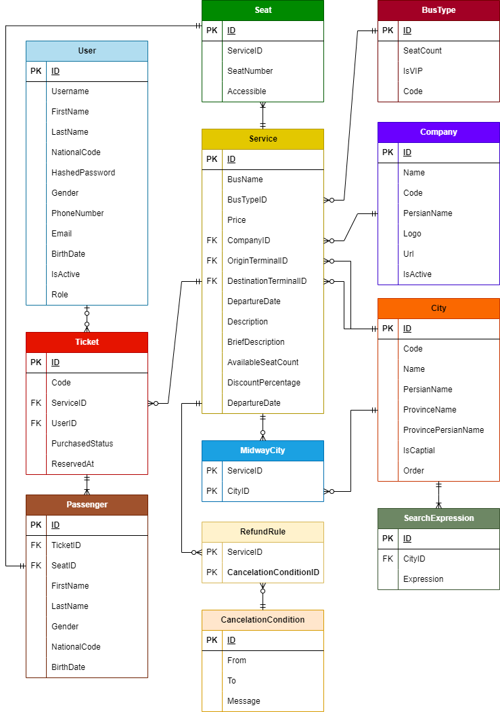

# سامانه رزرو بلیت اتوبوس

## معرفی پروژه

این پروژه یک سامانه رزرو بلیت اتوبوس است که با الهام از فرآیند و رابط کاربری وب‌سایت **Safar724** طراحی و پیاده‌سازی شده است. هدف از توسعه این پروژه، شبیه‌سازی فرآیند جستجوی سرویس‌های اتوبوس، مشاهده اطلاعات سفر و انتخاب صندلی با استفاده از معماری Full-Stack بوده است.

**نمونه طراحی رابط کاربری (UI):**

[مشاهده نمونه ظاهر وب‌سایت](https://drive.google.com/file/d/1bKAPiJDvvOPJwmRDGqtUo6dlS5NmOQBG/view?usp=sharing&utm_source=chatgpt.com)

این پروژه با استفاده از **Go (net/http، Gin، GORM)** در بخش Backend، **React + TypeScript + Vite** در بخش Frontend و **PostgreSQL (Neon)** به عنوان پایگاه داده توسعه یافته است.

---
# ویژگی‌های پروژه

* جستجوی سرویس‌های اتوبوس بر اساس مبدا، مقصد و تاریخ
* نمایش اطلاعات سرویس‌ها
* ارتباط Frontend و Backend از طریق REST API
* طراحی ساختار پایگاه داده بر اساس اصول نرمال‌سازی
* معماری چندبخشی (Frontend / Backend / Database)

---

# تکنولوژی‌های استفاده شده

## Backend

* Go
* net/http
* Gin
* GORM

## Frontend

* React
* TypeScript
* Vite
* React Router
* Jotai
* Tailwind CSS

## Database

* PostgreSQL
* Neon Database

---

# معماری پروژه

پروژه از سه بخش اصلی تشکیل شده است:

* **Frontend** برای رابط کاربری
* **Backend** برای مدیریت درخواست‌ها و منطق برنامه
* **PostgreSQL Database** برای ذخیره اطلاعات

ارتباط Frontend و Backend از طریق REST API انجام می‌شود و Backend نیز با استفاده از GORM با پایگاه داده PostgreSQL در ارتباط است.

---

# ساختار پروژه

```
backend/
│
├── db/
├── models/
└── server/

devs/
│
├── assets/
├── components/
├── pages/
└── util/
```

---

# مدل پایگاه داده (ERD)

تصویر ERD پروژه در این بخش قرار می‌گیرد.


### توضیح ساختار ERD

موجودیت‌های اصلی عبارت‌اند از:

* User
* Service
* Ticket
* Passenger
* Seat
* BusType
* Company
* City
* RefundRule
* CancelationCondition
* SearchExpression

روابط بین موجودیت‌ها به گونه‌ای طراحی شده است که:

* هر سرویس به یک شرکت اتوبوس‌رانی، نوع اتوبوس و شهرهای مبدا و مقصد وابسته است.
* هر کاربر می‌تواند چندین بلیت داشته باشد.
* هر مسافر به یک صندلی اختصاص داده می‌شود.
* برای هر سرویس، قوانین کنسلی و استرداد قابل تعریف است.

---

# ساختار Backend

Backend پروژه با زبان Go توسعه داده شده و شامل بخش‌های زیر است:

* تعریف مدل‌های داده با GORM
* مدیریت درخواست‌های HTTP
* پیاده‌سازی REST API
* ارتباط با PostgreSQL
* مدیریت Routing با Gin

---

# ساختار Frontend

رابط کاربری پروژه با React و TypeScript توسعه داده شده است.

ویژگی‌های اصلی Frontend:

* Component-Based Architecture
* مدیریت مسیرها با React Router
* مدیریت State با Jotai
* طراحی Responsive
* استفاده از Tailwind CSS

---

# تکنولوژی‌های کلیدی

| بخش              | فناوری       |
| ---------------- | ------------ |
| Backend          | Go           |
| HTTP Server      | net/http     |
| Web Framework    | Gin          |
| ORM              | GORM         |
| Frontend         | React        |
| Language         | TypeScript   |
| Build Tool       | Vite         |
| Routing          | React Router |
| State Management | Jotai        |
| Styling          | Tailwind CSS |
| Database         | PostgreSQL   |
| Cloud Database   | Neon         |

---

# اهداف پروژه

* آشنایی با توسعه Backend در Go
* طراحی REST API
* مدل‌سازی پایگاه داده رابطه‌ای
* توسعه رابط کاربری مدرن با React
* مدیریت ارتباط بین Frontend و Backend
* شبیه‌سازی فرآیند رزرو بلیت اتوبوس

---

# پیشنهادهای توسعه آینده

* احراز هویت کاربران
* پنل مدیریت
* ثبت و خرید بلیت
* اتصال به درگاه پرداخت
* مدیریت شرکت‌های اتوبوس‌رانی
* مدیریت ظرفیت سرویس‌ها
* سیستم گزارش‌گیری
* تاریخچه خرید کاربران
* قوانین استرداد و کنسلی پویا

---
